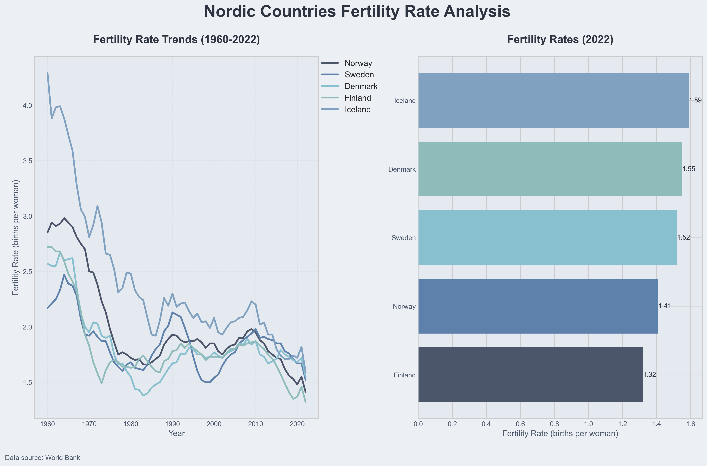

# Fertility Rate Dashboard

## Overview
This project creates an interactive dashboard visualizing fertility rate trends across Nordic countries using World Bank data. It demonstrates proficiency in data fetching, processing, and visualization using Python.



## Features
- Fetches real-time data from the World Bank API
- Creates a comprehensive dashboard with multiple visualizations
- Customizable for different countries and date ranges
- Implements error handling and user feedback

## Technologies Used
- Python 3.x
- Pandas for data manipulation
- Matplotlib and Seaborn for data visualization
- Requests for API interactions

## Visual Demonstration
The dashboard showcases:
1. Line graph of fertility rate trends (1960-2022)
2. Bar chart of latest fertility rates
3. Custom color palette and styling for enhanced readability

## Code Highlights
- Modular design with separate functions for data fetching, processing, and visualization
- Efficient use of APIs with proper error handling
- Dynamic chart generation based on input data
- Custom styling and color schemes for professional-looking output

## Usage
1. Ensure all required libraries are installed:
   ```
   pip install pandas matplotlib seaborn requests
   ```
2. Run the script:
   ```
   python fertility_dashboard.py
   ```
3. The dashboard will be saved as 'nordic_fertility_dashboard.png'

## Customization
To analyze different countries or indicators:
1. Modify the `nordic_countries` list
2. Change the `indicator` parameter in `fetch_world_bank_data()`

## Future Improvements
- Add interactive elements using libraries like Plotly
- Implement caching to reduce API calls
- Create a web interface for user input and real-time visualization

This project demonstrates strong coding skills in data analysis and visualization, showcasing the ability to create informative and visually appealing dashboards from real-world data sources.
